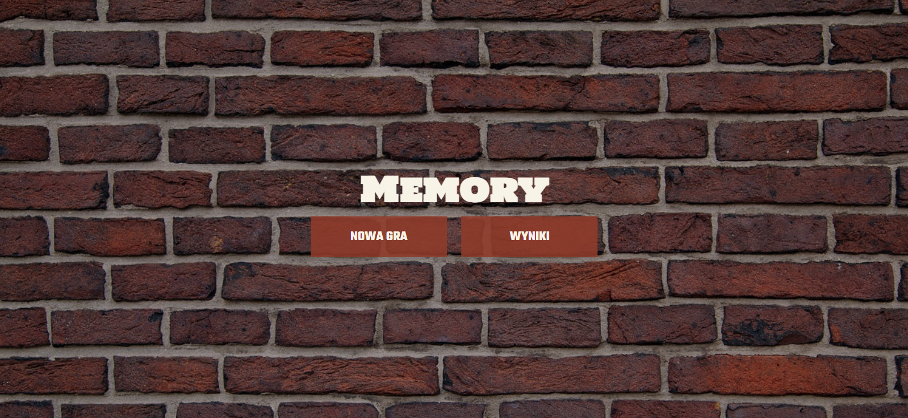
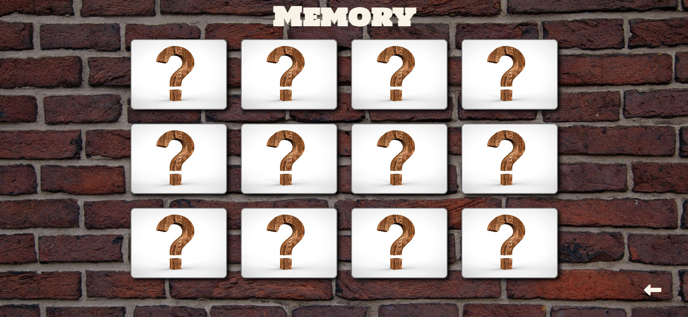
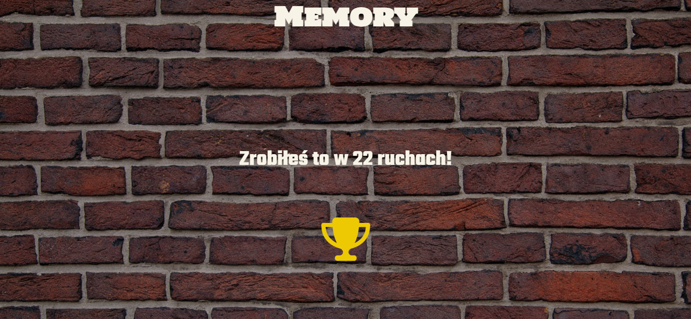
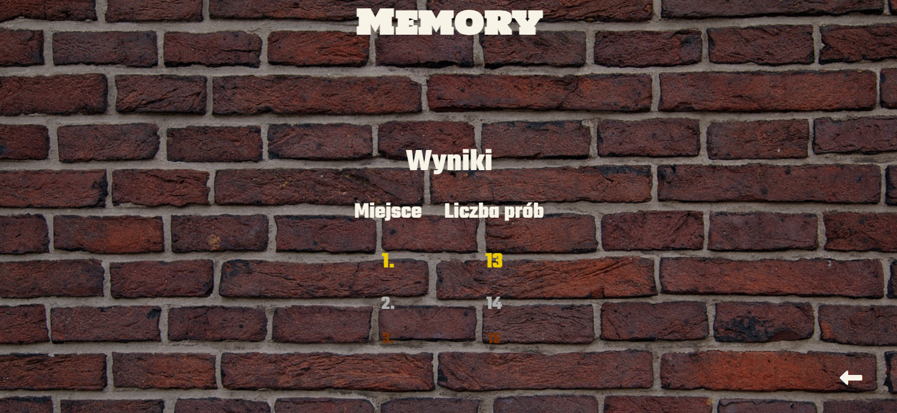

# Car Service App

Enjoy the Memory Game! Every time you start new game, cards take diffrent locations and images from https://shibe.online. You can see result after each game, and also previous results. The app is responsive to the most popular resolutions.

https://tom-kola.github.io/MemoryGame/

## The goal

This app was made to improve my JavaScript and TypeScript skills.

## Built with

<ul>
<li>HTML</li>
<li>SCSS</li>
<li>TypeScript</li>
</ul>

## Features

 <ul>
 <li>Play the Memory Game and enjoy!</li>
 <li>See your results</li>
 </ul>

## Project screenshots

### Main view

 

### Game view

 

### Game result

 

### Previous results

 
